# Proyecto SQL: Análisis de Criminalidad y Gestión Operativa (Arrestos)

## Resumen (Overview)
El departamento de Inteligencia y Gestión Estratégica Policial busca optimizar el despliegue de patrullas, identificar focos críticos de criminalidad (Hotspots) y comprender los perfiles demográficos para diseñar mejores políticas de prevención del delito. Sin embargo, los datos de origen se encuentran dispersos en archivos planos masivos y con serias inconsistencias estructurales que limitan su explotación analítica.

## 
<p align="center">
  <a href="https://www.linkedin.com/in/miguel-fanola-122a532ba/">
    
  </a>

  ## Estructura del Proyecto

- [Sobre los Datos](#sobre-los-datos)
- [Objetivo](#objetivo)
- [Tareas](#tareas)
- [Limpieza de Datos](#limpieza-de-datos)
- [Análisis Exploratorio de Datos e Insights](#análisis-exploratorio-de-datos-e-insights)
-  [Conclusiones](#conclusiones)

## Sobre los Datos

Los datos originales, junto con una explicación de cada columna, se pueden encontrar [aquí](https://www.kaggle.com/datasets/arathee2/arrests-by-baltimore-police-department).

El conjunto de datos unificado incluye una tabla maestra de analítica operacional  que captura perfiles demográficos, marcas de tiempo, geolocalización por cuadrantes y descripciones de los cargos delictivos, distribuidos en más de 123,600 registros y 15 columnas de información clave.

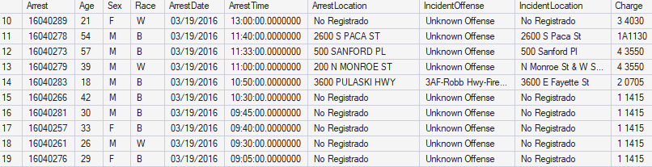
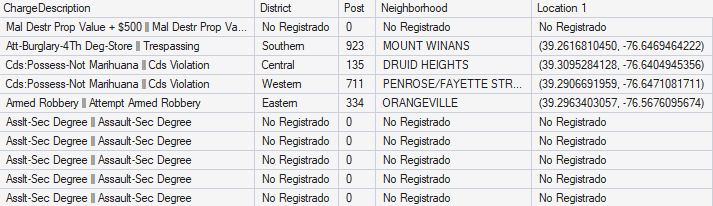

## Objetivo

Este proyecto individual tiene como objetivo demostrar habilidades de limpieza, y análisis exploratorio de datos (EDA) utilizando SQL Server. A través del análisis del registro histórico del departamento de policía, el cual cuenta con más de 123,600 registros de detenciones, se busca identificar patrones de criminalidad, evaluar la carga de trabajo por cuadrantes tácticos (Posts), modelar tendencias temporales y extraer insights operativos clave para optimizar la distribución de recursos de seguridad ciudadana.

## Tareas (Task)

1. ¿Cuál es el volumen total de arrestos y la edad promedio de los implicados por Distrito?
2. ¿Cuáles son las 10 edades de detenidos más frecuentes en el sistema?
3. ¿Cuántos arrestos se registraron por cada combinación de Sexo y Raza?
4. ¿Qué distritos específicos tienen más de 10,000 arrestos registrados?
5. Clasificación del volumen de arrestos por Rangos de Edad personalizados
6. ¿Cuáles son los 10 cargos criminales más frecuentes por los que se arresta a las personas?
7. Matriz comparativa de arrestos por delito (Top 10) desglosado por Género
8. ¿Cómo se distribuye la carga operativa entre los Turnos Policiales (Post) con mayor actividad?
9. Delitos donde el promedio de edad de los implicados es menor a 25 años
10. Segmentación estratégica de distritos basada en volumen y edad promedio
11. ¿Cuál es el volumen de arrestos por distrito y cómo se compara cada uno frente a los extremos (máximo y mínimo) de actividad en la ciudad?
12. Análisis de Vulnerabilidad de Género y Gravedad de Cargos por Distrito

## Limpieza de Datos

Antes de realizar cualquier tipo de análisis exploratorio, es fundamental asegurar que los datos cuenten con la calidad operativa necesaria. Dado que el archivo de origen (Arrestos.csv) presentaba filas huérfanas, datos corruptos.

#### Control de Filas Corruptas y Valores Huérfanos

El primer paso consistió en eliminar las filas del CSV que venían dañadas desde el origen (registros que iniciaban con comas y carecían de un número de control de arresto), ya que impedían la correcta indexación de la base de datos.

```sql
DELETE FROM dbo.Stg_BPD_Arrests 
WHERE Arrest IS NULL OR Arrest = '';
```

#### Tratamiento de Valores Faltantes (Imputación de NULLs)
Para no alterar el volumen analítico real de 123,699 registros (lo cual sesgaría los promedios de edades y las tendencias temporales), se optó por una estrategia de imputación en lugar de eliminación. Las celdas vacías de texto se estandarizaron bajo la etiqueta 'No Registrado' y los cuadrantes numéricos ausentes se asignaron a un valor bandera (0).
```sql
UPDATE dbo.Stg_BPD_Arrests
SET ArrestLocation = 'No Registrado'
WHERE ArrestLocation IS NULL;

UPDATE dbo.Stg_BPD_Arrests
SET IncidentLocation = 'No Registrado'
WHERE IncidentLocation IS NULL;

UPDATE dbo.Stg_BPD_Arrests
SET District = 'No Registrado'
WHERE District IS NULL;

UPDATE dbo.Stg_BPD_Arrests
SET Post = 0
WHERE Post IS NULL;

UPDATE dbo.Stg_BPD_Arrests
SET Neighborhood = 'No Registrado'
WHERE Neighborhood IS NULL;

UPDATE dbo.Stg_BPD_Arrests
SET ChargeDescription = 'Sin Descripcion'
WHERE ChargeDescription IS NULL;

UPDATE dbo.Stg_BPD_Arrests
SET [Location 1] = 'No Registrado'
WHERE [Location 1] IS NULL;
```
A continuación, es vital asegurarse de que se eliminen las filas duplicadas, en caso de encontrarse, nuevamente en los campos clave.

#### Verificar si la tabla tiene valores duplicados

```sql
-- Verificar valores duplicados en la tabla [dbo].[Stg_BPD_Arrests] --

SELECT * 
FROM dbo.Stg_BPD_Arrests
WHERE Arrest IN (
    SELECT Arrest 
    FROM dbo.Stg_BPD_Arrests
    GROUP BY Arrest
    HAVING COUNT(*) > 1
)
ORDER BY Arrest;
```

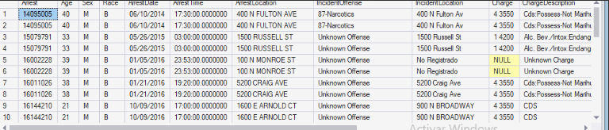

Como se evidenció en la ver imagen, el sistema clonó filas de forma exacta. Dado que la tabla no cuenta con una Clave Primaria (PK) física que impida esto, se aplicó una estrategia de reconstrucción segura: se filtraron los registros únicos a una tabla nueva, se eliminó la antigua con datos corruptos y se renombró la estructura final.

```sql
-- 1. Filtrar y transferir solo registros únicos a una nueva tabla
SELECT DISTINCT * INTO dbo.BPD_Arrests_Clean 
FROM dbo.Stg_BPD_Arrests;

-- 2. Eliminar la tabla original con datos duplicados
DROP TABLE dbo.Stg_BPD_Arrests;

-- 3. Renombrar la tabla limpia para mantener la consistencia del proyecto
EXEC sp_rename 'dbo.BPD_Arrests_Clean', 'Stg_BPD_Arrests';

-- Consulta de Validación Post-Limpieza
SELECT * FROM dbo.Stg_BPD_Arrests
WHERE Arrest IN (
    SELECT Arrest 
    FROM dbo.Stg_BPD_Arrests
    GROUP BY Arrest
    HAVING COUNT(*) > 1
)
ORDER BY Arrest;
```
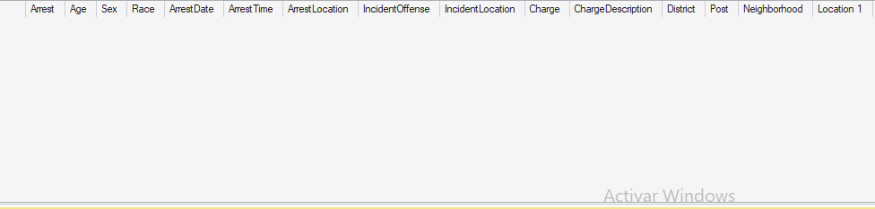

Al ejecutar la consulta de verificación después del proceso, el motor de base de datos devuelve cero filas, dejando el set de datos en un estado óptimo y confiable para la fase analítica.

## Análisis Exploratorio de Datos (EDA) e Insights

### Pregunta #1: ¿Cuál es el volumen total de arrestos por Distrito operativo?

```sql
SELECT 
    District,
    COUNT(*) AS TotalArrestos
FROM dbo.Stg_BPD_Arrests
GROUP BY District
ORDER BY TotalArrestos DESC;
```
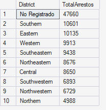

El análisis demuestra que, excluyendo los registros sin clasificar (No Registrado), la mayor carga operativa de la comisaría se concentra en los distritos Southern y Eastern, siendo las únicas jurisdicciones que superan de forma crítica la barrera de los 10,000 arrestos totales. Por el contrario, el distrito Northern registra la menor actividad delictiva con menos de 5,000 detenciones.

### Pregunta #2: ¿Cuáles son las 10 edades de detenidos más frecuentes en el sistema?

```sql

SELECT TOP 10
    Age,
    COUNT(*) AS CantidadCasos
FROM dbo.Stg_BPD_Arrests
WHERE Age IS NOT NULL
GROUP BY Age
ORDER BY CantidadCasos DESC;
```
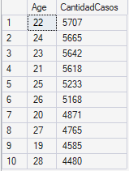

Los datos demuestran que la actividad delictiva y operativa se concentra críticamente en una población adulta joven. La edad con mayor cantidad de arrestos en el sistema es 22 años (con 5,707 casos), seguida muy de cerca por las edades de 24, 23 y 21 años. El "Top 10" completo está compuesto estrictamente por un rango cerrado de jóvenes de entre 19 y 28 años, lo que evidencia la urgencia de enfocar los planes de prevención social en este grupo etario específico.

### Pregunta #3: ¿Cuántos arrestos se registraron por cada combinación de Sexo y Raza?

```sql

SELECT 
    Sex,
    Race,
    COUNT(*) AS TotalArrestos
FROM dbo.Stg_BPD_Arrests
WHERE Sex IS NOT NULL AND Race IS NOT NULL
GROUP BY Sex, Race
ORDER BY TotalArrestos DESC;
```
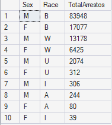

El análisis demográfico cruzado muestra una marcada concentración en el volumen de detenciones. La combinación de Hombres (M) de Raza "B" representa por amplio margen la mayor carga operativa del sistema con 83,948 arrestos, seguida en segundo lugar por las Mujeres (F) de Raza "B" (17,077 casos). En general, los datos reflejan que el volumen total de arrestos está fuertemente liderado por la población masculina en todas las categorías de raza registradas en el dataset.

### Pregunta #4: ¿Qué distritos específicos tienen más de 10,000 arrestos registrados?

```sql

SELECT 
    District,
    COUNT(*) AS TotalArrestos
FROM dbo.Stg_BPD_Arrests
GROUP BY District
HAVING COUNT(*) > 10000
ORDER BY TotalArrestos DESC;
```
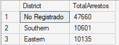

Los únicos distritos geográficos que superan de forma crítica el umbral operativo de los 10,000 arrestos en la ciudad son Southern (con 10,601 casos) y Eastern (con 10,135 casos). Estas dos jurisdicciones representan los principales focos de actividad delictiva masiva y concentran la mayor demanda de recursos para la jefatura.

### Pregunta #5: Clasificación del volumen de arrestos por Rangos de Edad personalizados

```sql

SELECT 
    CASE 
        WHEN Age < 18 THEN 'Menores (<18)'
        WHEN Age BETWEEN 18 AND 29 THEN 'Jóvenes Adultos (18-29)'
        WHEN Age BETWEEN 30 AND 55 THEN 'Adultos (30-55)'
        ELSE 'Adultos Mayores (56+)' 
    END AS CategoriaEdad,
    COUNT(*) AS TotalArrestos
FROM dbo.Stg_BPD_Arrests
WHERE Age IS NOT NULL
GROUP BY 
    CASE 
        WHEN Age < 18 THEN 'Menores (<18)'
        WHEN Age BETWEEN 18 AND 29 THEN 'Jóvenes Adultos (18-29)'
        WHEN Age BETWEEN 30 AND 55 THEN 'Adultos (30-55)'
        ELSE 'Adultos Mayores (56+)' 
    END
ORDER BY TotalArrestos DESC;
```
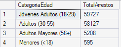

La segmentación por rangos personalizados revela que la carga operativa de la comisaría se concentra masivamente en dos grupos: los Jóvenes Adultos (18-29) lideran con 59,727 arrestos, seguidos muy de cerca por los Adultos (30-55) con 58,127 casos. Juntas, estas dos categorías representan la abrumadora mayoría de las detenciones, mientras que los sectores de Adultos Mayores y Menores de edad muestran una participación marginal en el total del sistema.

### Pregunta #6: ¿Cuáles son los 10 cargos criminales más frecuentes por los que se arresta a las personas?
```sql

SELECT TOP 10 
    ChargeDescription AS Cargo_Criminal,
    COUNT(*) AS Total_Arrestos
FROM dbo.Stg_BPD_Arrests
WHERE ChargeDescription IS NOT NULL 
  AND ChargeDescription <> 'Unknown Charge'
GROUP BY ChargeDescription
ORDER BY Total_Arrestos DESC;
```
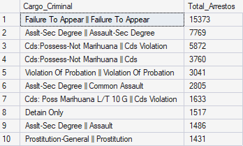

El análisis del "Top 10" de delitos revela que el cargo más recurrente en el sistema es, por amplio margen, "Failure To Appear" (Inasistencia al tribunal) con 15,373 arrestos, duplicando al segundo lugar. El resto de la carga operativa está dominado principalmente por delitos relacionados con agresiones físicas (Assault) e infracciones por posesión de sustancias (Cds Violation), consolidando los principales focos de intervención legal en la ciudad.

### Pregunta #7:Matriz comparativa de arrestos por delito (Top 10) desglosado por Género
```sql

SELECT TOP 10
    ChargeDescription,
    COUNT(CASE WHEN Sex = 'M' THEN 1 END) AS Arrestos_Hombres,
    COUNT(CASE WHEN Sex = 'F' THEN 1 END) AS Arrestos_Mujeres
FROM dbo.Stg_BPD_Arrests
WHERE Sex IN ('M', 'F')
GROUP BY ChargeDescription
ORDER BY COUNT(*) DESC;
```
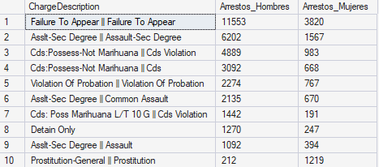

La matriz comparativa confirma que los hombres lideran de forma masiva casi todos los cargos del "Top 10", alcanzando su punto más alto en "Failure To Appear" con 11,553 casos masculinos frente a 3,820 femeninos. La única y notable excepción ocurre en el delito de "Prostitution-General", donde el patrón se invierte por completo, registrando una abrumadora mayoría de mujeres arrestadas (1,219 casos) en comparación con solo 212 hombres.

### Pregunta #8: ¿Cómo se distribuye la carga operativa entre los Turnos Policiales (Post) con mayor actividad?
```sql

WITH CTE_PostOperativos AS (
    SELECT 
        Post AS Turno_Sector,
        COUNT(*) AS Total_Arrestos
    FROM dbo.Stg_BPD_Arrests
    WHERE Post <> 0 AND Post IS NOT NULL
    GROUP BY Post
)
SELECT 
    Turno_Sector,
    Total_Arrestos
FROM CTE_PostOperativos
WHERE Total_Arrestos > 1000
ORDER BY Total_Arrestos DESC;
```
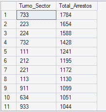

Esta consulta  permite consolidar y aislar eficazmente los sectores de patrullaje con mayor demanda de la ciudad. Los resultados muestran que el Turno/Sector 733 lidera la carga operativa con 1,784 arrestos, seguido muy de cerca por los sectores 223 y 224 (ambos por encima de las 1,500 detenciones). Este listado identifica con precisión los 11 cuadrantes críticos que superan el umbral de los 1,000 casos, sirviendo como base matemática para la asignación prioritaria de patrullas y recursos de apoyo en esas zonas de alta fricción.

### Pregunta #9: Delitos donde el promedio de edad de los implicados es menor a 25 años
```sql

SELECT 
    ChargeDescription AS Delito,
    ROUND(AVG(CAST(Age AS FLOAT)), 2) AS Edad_Promedio
FROM dbo.Stg_BPD_Arrests
WHERE Age > 0 AND ChargeDescription <> 'Unknown Charge'
GROUP BY ChargeDescription
HAVING AVG(CAST(Age AS FLOAT)) < 25
ORDER BY Edad_Promedio ASC;
```
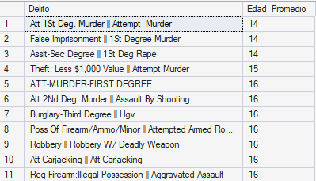

El filtro condicional en el promedio de edad revela una situación sumamente crítica y alarmante: los delitos más violentos y graves del sistema, como intento de homicidio (Attempt Murder), secuestro (False Imprisonment) y violación (1St Deg Rape), están liderados por poblaciones extremadamente jóvenes, registrando un promedio de edad de apenas 14 a 16 años. Este hallazgo evidencia la urgencia de coordinar esfuerzos inmediatos con las divisiones de justicia juvenil y programas de intervención temprana.

### Pregunta #10: Segmentación estratégica de distritos basada en volumen y edad promedio
```sql

WITH CTE_MetricasDistrito AS (
    SELECT 
        District AS Distrito,
        COUNT(*) AS Total_Arrestos,
        AVG(CAST(Age AS FLOAT)) AS Edad_Promedio
    FROM dbo.Stg_BPD_Arrests
    WHERE District <> 'No Registrado' AND Age > 0
    GROUP BY District
)
SELECT 
    Distrito,
    Total_Arrestos,
    ROUND(Edad_Promedio, 2) AS Edad_Promedio,
    CASE 
        WHEN Total_Arrestos > 12000 AND Edad_Promedio < 30 THEN 'CRÍTICO: Delincuencia Juvenil Masiva'
        WHEN Total_Arrestos > 12000 AND Edad_Promedio >= 30 THEN 'CRÍTICO: Delincuencia Adulta Concentrada'
        WHEN Total_Arrestos BETWEEN 5000 AND 12000 THEN 'ALERTA: Actividad Moderada en Monitoreo'
        ELSE 'ESTABLE: Bajo Impacto Operativo'
    END AS Clasificacion_Estrategica
FROM CTE_MetricasDistrito
ORDER BY Total_Arrestos DESC;
```
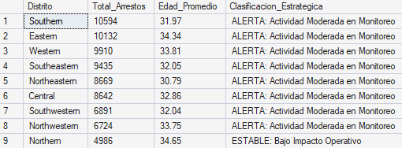

La segmentación estratégica muestra que la gran mayoría de los distritos (desde Southern hasta Northwestern) se agrupan homogéneamente bajo la categoría de "ALERTA: Actividad Moderada en Monitoreo", al mantenerse en un rango de entre 5,000 y 12,000 arrestos con promedios de edad adultos (superiores a los 30 años). El único caso fuera de esta tendencia es el distrito Northern, clasificado como "ESTABLE: Bajo Impacto Operativo" al situarse por debajo del umbral de las 5,000 detenciones totales.

### Pregunta #11: ¿Cuál es el volumen de arrestos por distrito y cómo se compara cada uno frente a los extremos (máximo y mínimo) de actividad en la ciudad?
```sql

WITH CTE_RankingDistritos AS (
    SELECT 
        District AS Distrito,
        COUNT(*) AS Total_Arrestos
    FROM dbo.Stg_BPD_Arrests
    WHERE District <> 'No Registrado'
    GROUP BY District
)
SELECT 
    ROW_NUMBER() OVER (ORDER BY Total_Arrestos DESC) AS Puesto_Oficial,
    Distrito,
    Total_Arrestos
FROM CTE_RankingDistritos;
```
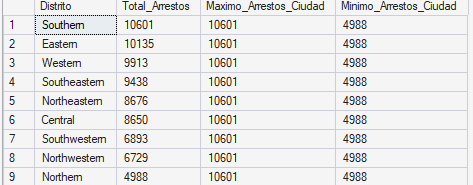

La comparación frente a los extremos de la ciudad revela una marcada brecha operativa entre jurisdicciones. Mientras que el distrito Southern define el techo de máxima actividad con 10,601 arrestos, el distrito Northern se ubica en el extremo opuesto con el mínimo absoluto de 4,988 casos. Este análisis demuestra matemáticamente que la carga de trabajo en el distrito más conflictivo duplica la del sector más seguro, un dato clave para la distribución proporcional del presupuesto y del personal.

### Pregunta #12: Análisis de Vulnerabilidad de Género y Gravedad de Cargos por Distrito
```sql

SELECT 
    District AS Distrito,
    COUNT(*) AS Total_Arrestos,
    SUM(CASE WHEN Sex = 'M' THEN 1 ELSE 0 END) AS Arrestos_Hombres,
    SUM(CASE WHEN Sex = 'F' THEN 1 ELSE 0 END) AS Arrestos_Mujeres,
    ROUND((CAST(SUM(CASE WHEN Sex = 'F' THEN 1 ELSE 0 END) AS FLOAT) / COUNT(*)) * 100, 2) AS Porcentaje_Mujeres
FROM dbo.Stg_BPD_Arrests
WHERE District <> 'No Registrado' AND Sex IN ('M', 'F')
GROUP BY District
ORDER BY Total_Arrestos DESC;
```
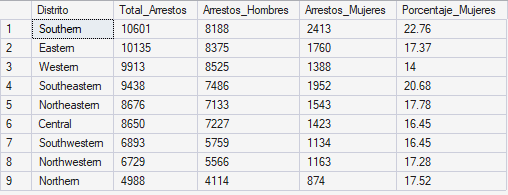

El KPI Porcentaje_Mujeres le permite a la jefatura entender la composición demográfica de los detenidos por zona. Si un distrito del norte tiene el doble de porcentaje de mujeres arrestadas en comparación con el promedio de la ciudad, se convierte en la prioridad número uno para la asignación de presupuestos de asistencia social preventiva y protocolos especializados de contención de género en sus calabozos.

### Conclusion

Este análisis proporcionó información importante sobre las áreas donde la jefatura de policía puede mejorar la eficiencia operativa y las estrategias de prevención del delito en la ciudad.

- Uno de los descubrimientos principales fue la alta concentración de la carga operativa en distritos específicos, donde un grupo selecto de jurisdicciones superó la barrera crítica de los 10,000 arrestos, liderando el ranking oficial de actividad.

- Se detectaron niveles de riesgo variables dependiendo de los rangos de edad y el género de los implicados. Se identificaron delitos específicos donde el promedio de edad es alarmantemente joven (menor a 25 años) y distritos con una vulnerabilidad de género atípica debido a un mayor porcentaje de mujeres detenidas.

- Para abordar estos problemas, la institución debe tomar la iniciativa y enfocarse en el despliegue táctico de recursos hacia los hotspots o vecindarios de calor crítico identificados dentro de cada distrito.

- Es fundamental fortalecer los programas de prevención comunitaria e intervención juvenil en las zonas donde el perfil de los detenidos es notablemente más joven, atacando las causas de los 10 cargos criminales más frecuentes desde la raíz escolar y social.

